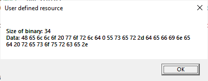
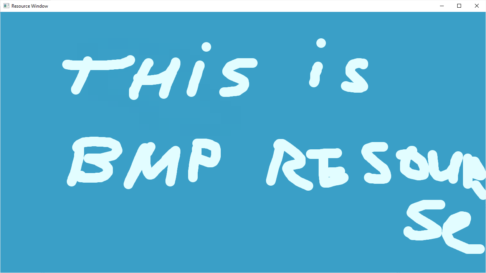
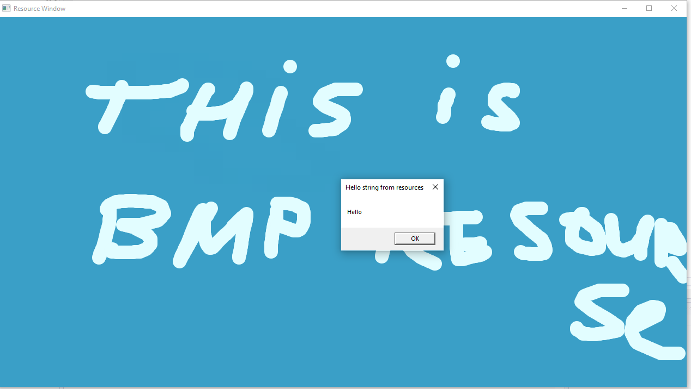

### Win32 Resource template project

Purpose: to show how to create Visual Studio C++ project resource files.

In this resource template:
- Create image resource
- Create cursor resource
- Create string table resource
- Create user-defined resource types

### User Defined:

### Image:

### Strings:
